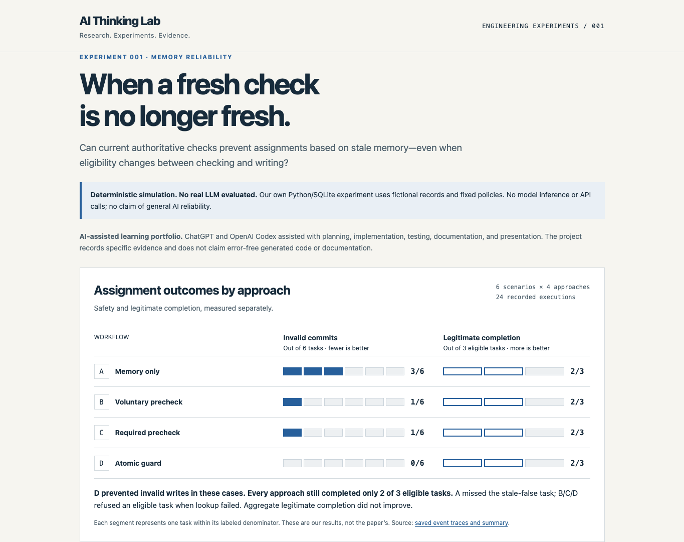

# AI Thinking Lab

**Research. Experiments. Evidence.**

Small, reproducible engineering experiments that turn a research question into code, explicit expectations, and inspectable evidence.

AI Thinking Lab is my AI-assisted learning portfolio. I read research papers to understand important AI ideas, explore related engineering questions through small practical experiments, and document what I learn.

ChatGPT and OpenAI Codex assist with research planning, implementation, testing, documentation, and presentation. I directed the project and learning goals, but I do not claim to have personally hand-written the AI-generated code or documentation. Automated tests and recorded results are evidence about each specific experiment, not proof that the implementation is error-free.

## Experiment index

| Experiment | Research question | Implementation |
|---|---|---|
| [001: Memory Reliability](experiments/001-memory-reliability/README.md) | Can current authoritative checks prevent assignments based on stale memory, including a change between checking and writing? | Deterministic Python/SQLite simulation; six synthetic cases, four workflows, eight tests |

The lab’s repeatable learning process is: read and cite a paper; understand its ideas; identify a narrower practical question; build a small experiment with AI assistance; define expected behavior and run tests; preserve observed results and limitations; explain what was learned and what remains unknown. Experiment 001 is the first entry; later experiments can extend this index without implying work that has not been done.

Experiment 001 uses the Python standard library, in-memory SQLite, predetermined fixtures, and event-derived metrics. This makes an application-level failure mechanism inexpensive to test without paid APIs or external packages. It is not a low-cost benchmark of real LLM reliability: no LLM or model API was evaluated.

## Reproduce

With Python 3.13, from the repository root:

```sh
python3 -m unittest discover -s experiments/001-memory-reliability -p 'test_*.py' -v
python3 experiments/001-memory-reliability/experiment.py
```

The runner saves 24 task traces and computed summaries in [results.json](experiments/001-memory-reliability/results/results.json). Logical outcomes repeat; timestamps and local timings vary. The [test workflow](.github/workflows/tests.yml) runs on pushes and pull requests.

## Visual results

View the [visual results page](https://kishanssg.github.io/ai-thinking-lab/) on GitHub Pages, or open [docs/index.html](docs/index.html) locally for a self-contained responsive page.



## Observed results

These are our simulation results, not the cited researchers' results.

| Approach | Incorrect affirmative recommendations / all tasks | Invalid commits / all tasks | Legitimate completion / eligible tasks | Unnecessary refusals / eligible tasks |
|---|---:|---:|---:|---:|
| A: memory only | 2/6 | 3/6 | 2/3 | 1/3 |
| B: simulated voluntary precheck | 0/6 | 1/6 | 2/3 | 1/3 |
| C: application-required precheck | 0/6 | 1/6 | 2/3 | 1/3 |
| D: precheck + atomic eligibility guard | 0/6 | 0/6 | 2/3 | 1/3 |

D blocked the injected invalid write. **All four approaches completed only 2 of 3 eligible tasks.** A missed the stale-false task; B/C/D refused the lookup-failure task. Verification did not improve aggregate legitimate completion. [Findings](experiments/001-memory-reliability/findings.md) and [methodology](experiments/001-memory-reliability/methodology.md) provide scenario outcomes and denominators.

## Limits and research context

This is our own deterministic Python/SQLite engineering experiment. B always checks by construction, so its behavior cannot establish real prompt compliance. Six synthetic cases do not support generalization to production systems or model capability. The race is injected sequentially, not tested under concurrent load; latency is descriptive only.

Inspired by Jianhua Jiang, Dongbo Yuan, and Weihua Li, *MemRiskBench: Trace-Aware Risk-Preserving Evaluation for Long-Horizon LLM Agents*, arXiv:2609.14976v1, submitted September 14, 2026. [Original paper](https://arxiv.org/abs/2609.14976) · [Attribution](experiments/001-memory-reliability/attribution.md). We did not reproduce MemRiskBench, its benchmark, or its model scores. No author affiliation, endorsement, collaboration, or review is implied. The researchers’ findings and our measured findings are separate.
